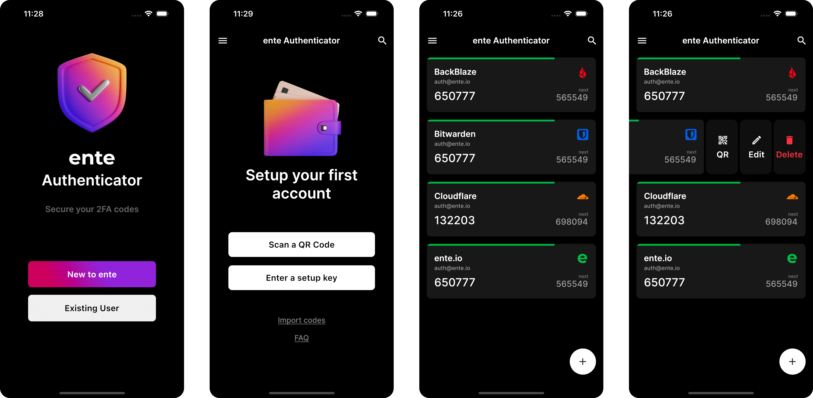

# ente Authenticator


[](https://crowdin.com/project/ente-authenticator-app) 
 [](https://matrix.to/#/#ente:matrix.org)

ente's Authenticator app helps you generate and store 2 step verification (2FA)
tokens on your mobile devices.

[Download now](#-download)



## ✨ Features

### Secure Backups

ente provides end-to-end encrypted cloud backups so that you don't have to worry
about losing your tokens. We use the same protocols [ente
Photos](https://ente.io) uses to encrypt and preserve your data.


### Multi Device Synchronization

ente will automatically sync the 2FA tokens you add to your account, across all
your devices. Every new device you sign into will have access to these tokens.


### Offline Mode

ente generates 2FA tokens offline, so your network connectivity will not get in
the way of your workflow.

### Import and Export Tokens

You can add tokens to ente by one of the following methods:
1. Scanning a QR code
2. Manually entering (copy-pasting) a 2FA secret
3. Bulk importing from other popular 2FA apps and from a file  that contains a list of codes in the following format:.
    ```
    otpauth://totp/provider.com:you@email.com?secret=YOUR_SECRET
    ```

You can export the codes you have added to ente, to either an **encrypted** or plain text file. 


## 📲 Download

### Android

This repository's [GitHub
releases](https://github.com/ente-io/auth/releases/latest/download/ente-auth.apk)
contains APKs, built straight from source. These builds keep themselves updated,
without relying on third party stores.

You can alternatively install the build from PlayStore or F-Droid.

<a href="https://play.google.com/store/apps/details?id=io.ente.auth"> 
</a>

<a href="https://f-droid.org/packages/io.ente.auth/">
  
</a>

### iPhone / Apple Silicon


<a href="https://apps.apple.com/us/app/ente-authenticator/id6444121398"> 
</a>

### Web / Desktop

You can view your 2FA codes at [auth.ente.io](https://auth.ente.io). For adding or managing your secrets, please use our mobile app.


## 🔩 Architecture

The architecture that powers end-to-end encrypted storage and sync of your
tokens has been documented [here](architecture/README.md).

## 🧑‍💻 Contribute

Please refer to the [contribution guide](./CONTRIBUTING.md) if you wish to add an icon, assist with translation, or develop new features.

You can also support us by giving this project a ⭐ star on GitHub or by leaving a review on [PlayStore](https://play.google.com/store/apps/details?id=io.ente.auth), [AppStore](https://apps.apple.com/us/app/ente-authenticator/id6444121398) or [AlternativeTo](https://alternativeto.net/software/ente-authenticator/).


## 🧑‍💻 Building from source

1. [Install Flutter](https://flutter.dev/docs/get-started/install)
2. Clone this repository with `git clone git@github.com:ente-io/auth.git` 
3. Pull in all submodules with `git submodule update --init --recursive`
4. For Android, [setup your keystore](https://docs.flutter.dev/deployment/android#create-an-upload-keystore) and run `flutter build apk --release --flavor independent`
5. For iOS, run `flutter build ios` 

For maintainers, there is [additional documentation](RELEASES.md) on
automatically publishing the main branch to App store, Play store and GitHub
releases.


## 🙋‍♂️ Help

If you need help, please reach out to support@ente.io, and a human will get in
touch with you.

If you have feature requests, please create a [GitHub issue](https://github.com/ente-io/auth/issues/).


## 💜 Community

- Follow us on [Twitter](https://twitter.com/enteio) / [Mastodon](https://mstdn.social/@ente)
- Join us on [Discord](https://ente.io/discord) / [Matrix](https://ente.io/matrix)
