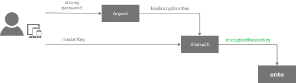
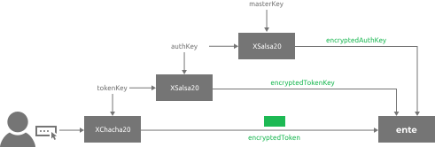
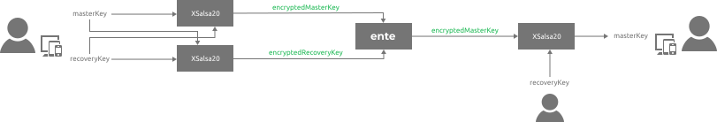
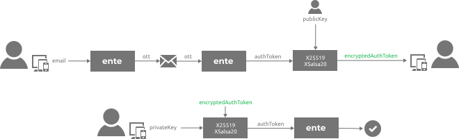

# Architecture

This is an overview of ente's end-to-end encrypted architecture and
specifications of the underlying cryptography.

## Introduction

Your data is end-to-end encrypted with **ente**. Meaning, they are encrypted
with your `keys` before they leave your device.

 

These `keys` are available only to you. Meaning only you can access your data
else where.

What follows is an explanation of how we do what we do.

## Key Encryption

### Fundamentals

#### Master Key

When you sign up for **ente**, your client generates a `masterKey` for you. This
never leaves your device unencrypted.

#### Key Encryption Key

Once you choose a password, a `keyEncryptionKey` is derived from it. This never
leaves your device.

### Flows

#### Primary Device

During registration, your `masterKey` is encrypted with your`keyEncryptionKey`,
and the resultant `encryptedMasterKey` is then sent to our servers for storage.

####  Secondary Device

When you sign in on a secondary device, after you successfully verify your
email, our servers give you back your `encryptedMasterKey` that was sent to us
by your primary device.

You are then prompted to enter your password. Once entered, your
`keyEncryptionKey` is derived, and the client decrypts your `encryptedMasterKey`
with this, to yield your original `masterKey`.

If the decryption fails, the client will know that the derived
`keyEncryptionKey` was wrong, indicating an incorrect password, and this
information will be surfaced to you.

### Privacy

- Since only you know your password, only you can derive your
  `keyEncryptionKey`.
- Since only you can derive your `keyEncryptionKey`, only you have access to
  your `masterKey`.

> Keep reading to learn about how this `masterKey` is used to encrypt your data.

---

## Token Encryption

### Fundamentals

#### Token Key

Each of your tokens in **ente** are encrypted with a `tokenKey`. These never
leave your device unencrypted.

#### Authenticator Key

Each of your `tokenKey`s are in turn encrypted with an `authKey`. This never
leave your device unencrypted.

### Flows

#### Upload

- Each token and associated metadata is encrypted with randomly generated
  `tokenKey`s.
- Each `tokenKey` is encrypted with your `authKey`. In case your account does
  not have an `authKey` yet, one is randomly generated and encrypted with your
  `masterKey`.
- All of the above mentioned encrypted data is then pushed to the server for
  storage.
  

#### Download

- All of the above mentioned encrypted data is pulled from the server.
- You first decrypt your `authKey` with your `masterKey`.
- You then decrypt each token's `tokenKey` with your `authKey`.
- Finally, you decrypt each token and associated metadata with the respective
  `tokenKey`s.

### Privacy

- As explained in the previous section, only you have access to your
  `masterKey`.
- Since only you have access to your `masterKey`, only you can decrypt your
  `authKey`.
- Since only you have access to your `authKey`, only you can decrypt the
  `tokenKey`s.
- Since only you have access to the `tokenKey`s, only you can decrypt the tokens
  and their associated metadata.

---

## Key Recovery

### Fundamentals

#### Recovery Key

When you sign up for **ente**, your app generates a `recoveryKey` for you. This
never leaves your device unencrypted.

### Flow

#### Storage

Your `recoveryKey` and `masterKey` are encrypted with each other and stored on
the server.

#### Access

This encrypted `recoveryKey` is downloaded when you sign in on a new device.
This is decrypted with your `masterKey` and surfaced to you whenever you request
for it.

#### Recovery

Post email verification, if you're unable to unlock your account because you
have forgotten your password, the client will prompt you to enter your
`recoveryKey`.

The client then pulls the `masterKey` that was earlier encrypted and pushed to
the server (as discussed in [Key Encryption](#key-encryption), and decrypts it
with the entered `recoveryKey`. If the decryption succeeds, the client will know
that you have entered the correct `recoveryKey`.

Now that you have your `masterKey`, the client will prompt you to set a new
password, using which it will derive a new `keyEncryptionKey`. This is then used
to encrypt your `masterKey` and this new `encryptedMasterKey` is uploaded to our
servers, similar to what was earlier discussed in [Key
Encryption](#key-encryption).

### Privacy

- Since only you have access to your `masterKey`, only you can access your
  `recoveryKey`.
- Since only you can access your `recoveryKey`, only you can reset your
  password.

---

## Authentication

### Fundamentals

#### One Time Token

When you attempt to verify ownership of an email address, our server generates a
`oneTimeToken`, that if presented confirms your access to the said email
address. This token is valid for a short time and can only be used once.

#### Authentication Token

When you successfully authenticate yourself against our server by proving
ownership of your email (and in future any other configured vectors), the server
generates an `authToken`, that can from there on be used to authenticate against
our private APIs.

#### Encrypted Authentication Token

A generated `authToken` is returned to your client after being encrypted with
your `publicKey`. This `encryptedAuthToken` can only be decrypted with your
`privateKey`.

### Flow

- You are asked for an email address, to which a `oneTimeToken` is sent.
- Once you present this information correctly to our server, an `authToken` is
  generated and an `encryptedAuthToken` is returned to you, along with your
  other encrypted keys.
- You are then prompted to enter your password, using which your `masterKey` is
  derived (as discussed [here](#key-encryption-flows-secondary-device)).
- Using this `masterKey`, the rest of your keys, including your `privateKey` is
  decrypted (as discussed [here](#private-key)).
- Using your `privateKey`, the client will then decrypt the `encryptedAuthToken`
  that was earlier encrypted by our server with your `publicKey`.
- This decrypted `authToken` can then from there on be used to authenticate all
  API calls against our servers.

### Security

Only by verifying access to your email and knowing your password can you obtain
an `authToken` that can be used to authenticate yourself against our servers.

---

## Implementation Details

We rely on the high level APIs exposed by this wonderful library called
[libsodium](https://libsodium.gitbook.io/doc/).

#### Key Generation

[`crypto_secretbox_keygen`](https://libsodium.gitbook.io/doc/public-key_cryptography/sealed_boxes)
is used to generate all random keys within the application. Your `masterKey`,
`recoveryKey`, `authKey`, `tokenKey` are all 256-bit keys generated using this
API.

#### Key Derivation

[`crypto_pwhash`](https://libsodium.gitbook.io/doc/password_hashing/default_phf)
is used to derive your `keyEncryptionKey` from your password.

`crypto_pwhash_OPSLIMIT_SENSITIVE` and `crypto_pwhash_MEMLIMIT_SENSITIVE` are
used as the limits for computation and memory respectively. If the operation
fails due to insufficient memory, the former is doubled and the latter is halved
progressively, until a key can be derived. If during this process the memory
limit is reduced to a value less than `crypto_pwhash_MEMLIMIT_MIN`, the client
will not let you register from that device.

Internally, this uses [Argon2
v1.3](https://github.com/P-H-C/phc-winner-argon2/raw/master/argon2-specs.pdf),
which is regarded as [one of the best hashing
algorithms](https://en.wikipedia.org/wiki/Argon2) currently available.

#### Symmetric Encryption

[`crypto_secretbox_easy`](https://libsodium.gitbook.io/doc/secret-key_cryptography/secretbox)
is used to encrypt your `masterKey`, `recoveryKey`, `authKey` and `tokenKey`s.
Internally, this uses
[XSalsa20](https://libsodium.gitbook.io/doc/advanced/stream_ciphers/xsalsa20)
stream cipher with [Poly1305
MAC](https://datatracker.ietf.org/doc/html/rfc8439#section-2.5) for
authentication.

[`crypto_secretstream_*`](https://libsodium.gitbook.io/doc/secret-key_cryptography/secretstream)
APIs are used to encrypt your token data. Internally, this uses
[XChaCha20](https://libsodium.gitbook.io/doc/advanced/stream_ciphers/xchacha20)
stream cipher with [Poly1305
MAC](https://datatracker.ietf.org/doc/html/rfc8439#section-2.5) for
authentication.

#### Salt & Nonce Generation

[`randombytes_buf`](https://libsodium.gitbook.io/doc/generating_random_data) is
used to generate a new salt/nonce every time data needs to be hashed/encrypted.

---

## Further Details

Thank you for reading this far! For implementation details, we request you to
checkout [our code](https://github.com/ente-io).

If you'd like to help us improve this document, kindly email
[security@ente.io](mailto:security@ente.io).
