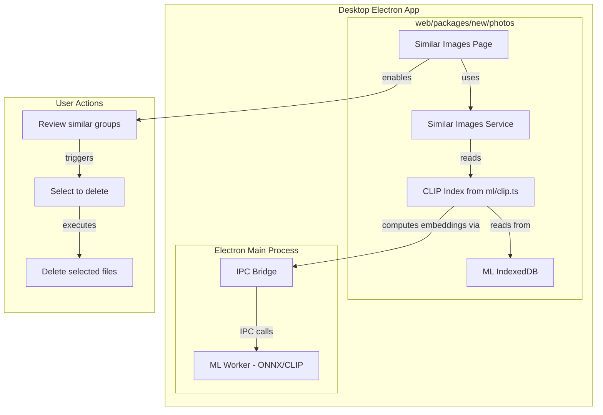

# Similar Images Cleanup - Desktop Implementation Plan

## Overview

Implement the "Similar Images Cleanup" feature for desktop/macOS, matching the existing mobile functionality. This feature allows users to find and remove visually similar photos using ML-based similarity detection.

## Current State Analysis

### Mobile Implementation ✅
- **Location**: `mobile/apps/photos/lib/services/machine_learning/similar_images_service.dart`
- **UI**: `mobile/apps/photos/lib/ui/tools/similar_images_page.dart`
- **Menu**: Settings → Backup → Free Space → "Similar Images"
- **Tech Stack**: Flutter + Rust (usearch vector DB) + ML

### Desktop Current State ⚠️
- **Has ML Infrastructure**: ONNX Runtime + CLIP models in `desktop/src/main/services/ml-worker.ts`
- **Has CLIP Embeddings Storage**: IndexedDB in `web/packages/new/photos/services/ml/db.ts`
- **Has CLIP Search**: Text-to-image search in `web/packages/new/photos/services/ml/clip.ts`
- **Missing**: Similar Images cleanup UI and logic

### Web Existing Features
- **Duplicates Page** (`/duplicates`): Finds exact duplicates by hash (different from similar images)
- **CLIP Search**: Text-to-image semantic search
- **ML Indexing**: Computes and stores CLIP embeddings locally

---

## Architecture Diagram



---

## Implementation Steps

### Phase 1: Core Similar Images Logic

#### 1.1 Create Similar Images Service
**File**: `web/packages/new/photos/services/similar-images.ts`

**Purpose**: Core logic for finding similar images using CLIP embeddings

**Key Functions**:
- `getSimilarImages(options)`: Find groups of similar images
- `calculateSimilarity(embedding1, embedding2)`: Cosine similarity
- `groupSimilarImages(files, threshold)`: Group by similarity

**Algorithm**:
```typescript
// Pseudocode
function findSimilarImages(files, threshold = 0.04) {
    // Get all CLIP embeddings for files
    const embeddings = files.map(f => getCLIPEmbedding(f));
    
    // Compare all pairs (O(n²) - optimize later if needed)
    const similarGroups = [];
    const used = new Set();
    
    for (let i = 0; i < embeddings.length; i++) {
        if (used.has(i)) continue;
        
        const group = [embeddings[i]];
        used.add(i);
        
        for (let j = i + 1; j < embeddings.length; j++) {
            if (used.has(j)) continue;
            
            const similarity = cosineSimilarity(
                embeddings[i].embedding,
                embeddings[j].embedding
            );
            
            if (similarity >= (1 - threshold)) {
                group.push(embeddings[j]);
                used.add(j);
            }
        }
        
        if (group.length > 1) {
            similarGroups.push(group);
        }
    }
    
    return similarGroups;
}
```

#### 1.2 Create Type Definitions
**File**: `web/packages/new/photos/services/similar-images-types.ts`

```typescript
export interface SimilarImageGroup {
    id: string;
    files: EnteFile[];
    furthestDistance: number;
    totalSize: number;
}

export interface SimilarImagesOptions {
    distanceThreshold?: number;
    exact?: boolean;
    forceRefresh?: boolean;
}

export enum SimilarImageCategory {
    CLOSE = 'close',
    SIMILAR = 'similar',
    RELATED = 'related'
}
```

---

### Phase 2: UI Implementation

#### 2.1 Create Similar Images Page
**File**: `web/packages/new/photos/pages/similar-images.tsx`

**Features**:
- Setup screen with threshold slider
- Loading indicator with progress
- Results grid with grouped similar images
- Tab filtering (Close/Similar/Related)
- Sort options (Size, Distance, Count)
- Selection bulk actions
- Delete confirmation dialog

**Components**:
- SimilarImagesPage (main container)
- SimilarImagesGrid (virtualized list)
- SimilarImagesGroup (group card)
- ThresholdSlider (setup)
- CategoryTabs (Close/Similar/Related)
- SortOptionsMenu
- DeleteConfirmationDialog

#### 2.2 Add to Sidebar Navigation
**File**: `web/apps/photos/src/components/Sidebar.tsx`

**Changes**:
```typescript
{
    onRouteToSimilarImages: () => router.push("/similar-images"),
}
```

**Location**: Settings → Free Space section

#### 2.3 Add Translations
**File**: `web/packages/base/locales/en-US/translation.json`

**Keys to add**:
```json
{
    "similarImages": "Similar images",
    "findSimilarImages": "Find similar images",
    "noSimilarImagesFound": "No similar images found",
    "yourPhotosLookUnique": "Your photos look unique",
    "similarGroupsFound": "{count} groups found",
    "reviewAndRemoveSimilarImages": "Review and remove similar images",
    "deletePhotosWithSize": "Delete {count} photos ({size})",
    "similarImagesCount": "{count} similar images",
    "similarity": "Similarity",
    "analyzingPhotosLocally": "Analyzing your photos locally...",
    "closeBy": "Close by",
    "similar": "Similar",
    "related": "Related"
}
```

---

### Phase 3: Desktop Integration

#### 3.1 Expose ML Functions to Web Layer
**File**: `desktop/src/preload.ts`

**Note**: Already has `triggerCreateUtilityProcess` for ML. No additional IPC needed.

#### 3.2 Verify ML Worker Compatibility
**File**: `desktop/src/main/services/ml-worker.ts`

- `computeCLIPImageEmbedding` is exposed ✓
- Models are downloaded on demand ✓
- Works with Electron utility process ✓

#### 3.3 Desktop Menu Integration
**File**: `desktop/src/main/menu.ts`

**Add menu item**:
```typescript
{
    label: 'Similar Images',
    click: () => {
        mainWindow?.webContents.send('openSimilarImages');
    },
}
```

**Location**: After "Free Up Space" or "Deduplicate" menu item

---

### Phase 4: Delete Functionality

#### 4.1 Reuse Existing Delete Logic
**File**: `web/packages/new/photos/services/dedup.ts`

The `removeSelectedDuplicateGroups` function already handles file retention, collection management, trash operations, and local sync. We'll follow the same pattern.

#### 4.2 Create Similar Images Delete Service
**File**: `web/packages/new/photos/services/similar-images-delete.ts`

```typescript
export const removeSelectedSimilarImageGroups = async (
    groups: SimilarImageGroup[],
    onProgress: (progress: number) => void,
) => {
    // Follow same pattern as dedup.ts
    // 1. Identify files to retain vs delete
    // 2. Add retained files to affected collections
    // 3. Move deleted files to trash
    // 4. Sync local state
};
```

---

### Phase 5: Performance Optimization

#### 5.1 Caching Strategy
- Cache similar images results in IndexedDB ✅ Done
- Invalidate cache when:
  - New files are indexed ✅ Done
  - Files are deleted ✅ Done
  - Threshold changes ✅ Done (client-side filtering, no re-analysis needed)

#### 5.2 Incremental Updates
- Compare cached results with current state
- Only recompute for new/deleted files
- Preserve existing groupings where possible

#### 5.3 Large Library Handling
- Show progress during computation ✅ Done (with HNSW integration)
- Process in batches
- Allow cancellation
- Handle out-of-memory gracefully

---

### Phase 7: HNSW Index Persistence (Performance Improvement)

**Problem**: Index building takes 10+ minutes for 130k+ images with no progress indication during critical `addItems()` phase.

**Goal**: First load ~7 min (one-time), subsequent loads <5 seconds.

#### 7.1 HNSW Index Serialization and Persistence
**Objective**: Store built HNSW index in IndexedDB to avoid rebuilding on every page load.

**Approach**:
1. Check if hnswlib-wasm supports index serialization (`saveIndex()` / `loadIndex()`)
2. Add serialization methods to `HNSWIndex` class:
   - `serializeIndex(): Uint8Array` - Export index to binary format
   - `deserializeIndex(data: Uint8Array): void` - Load index from binary
3. Store serialized index in ML DB:
   - New object store: `hnsw-index-cache`
   - Key: `"clip-hnsw-index"`
   - Value: `{ data: Uint8Array, fileIDHash: string, createdAt: number }`
4. On page load:
   - Try to load cached index
   - Verify cache validity (file hash match)
   - Deserialize if valid, rebuild if not

**Cache Invalidation**:
- Generate hash from sorted file IDs that were indexed
- Compare current file IDs hash with cached hash
- Rebuild only if hashes don't match (files added/removed)

**Expected Performance**:
- First analysis: ~7 minutes (build + serialize + store)
- Subsequent loads: ~2-5 seconds (load + deserialize)
- 100x+ speedup for repeat visits

#### 7.2 Batched Vector Addition with Detailed Progress
**Objective**: Provide granular progress updates during slow index building phase.

**Current Issue**:
- `index.addItems(items, true)` is synchronous and blocks for 10+ minutes
- No progress updates during this critical phase
- Progress bar appears frozen

**Solutions Evaluated**:
1. **Batch addItems()** - Add vectors in chunks with progress between batches
   - Problem: hnswlib doesn't support incremental adds efficiently
2. **Web Worker** - Offload to worker thread
   - Problem: Complex data transfer, hnswlib-wasm may not work in worker
3. **Yield during conversion** ✅ - Already implemented, works well
4. **Time estimation** ✅ - Show estimated time remaining

**Selected Approach**: Enhanced progress feedback
- Measure index build time on first run
- Store timing metrics (vectors/second) in cache
- Use metrics to estimate time remaining on subsequent first-time builds
- Display: "Building index... 23,450 / 130,385 vectors - ~6 minutes remaining"

#### 7.3 Lazy Loading with Cached Results
**Objective**: Show instant results from cache while rebuilding index in background.

**User Flow**:
1. User opens Similar Images page
2. **Immediate**: Load and display cached results (if available)
   - Show banner: "Showing cached results from [timestamp]"
3. **Background**: Check if index needs rebuild (file hash comparison)
4. **If rebuild needed**:
   - Start rebuild silently in background
   - Keep showing cached results
   - Update progress in background indicator
5. **On rebuild complete**:
   - Show notification: "Fresh analysis complete - Reload results?"
   - Allow user to continue with cache or reload

**Staleness Indicators**:
- Badge: "Cached results from 2 hours ago"
- Subtle background color difference
- Refresh button to force rebuild

**Benefits**:
- Zero perceived wait time for repeat visits
- User can start reviewing/deleting immediately
- Background rebuild doesn't disrupt workflow
- Fresh results available when ready

#### 7.4 Smart Cache Invalidation
**Approach**: Hash-based detection

**File ID Hash**:
```typescript
const generateFileIDHash = (fileIDs: number[]): string => {
    const sorted = [...fileIDs].sort((a, b) => a - b);
    const str = sorted.join(',');
    return hashString(str); // Fast string hash
};
```

**Cache Validity Check**:
```typescript
const isCacheValid = (
    cached: CachedIndex,
    currentFileIDs: number[]
): boolean => {
    const currentHash = generateFileIDHash(currentFileIDs);
    return cached.fileIDHash === currentHash;
};
```

**Invalidation Triggers**:
- File added: Hash changes → rebuild
- File deleted: Hash changes → rebuild
- Same files, different order: Hash same → use cache ✅
- Manual invalidation: Settings button "Rebuild similarity index"

#### 7.5 Implementation Checklist

- [ ] Research hnswlib-wasm serialization API
- [ ] Add serialization methods to HNSWIndex class
- [ ] Create `hnsw-index-cache` object store in ML DB
- [ ] Implement file ID hash generation
- [ ] Add cache save/load logic to similar-images.ts
- [ ] Implement cache validity checking
- [ ] Add batched progress reporting with time estimates
- [ ] Implement lazy loading with cached results display
- [ ] Add staleness indicators to UI
- [ ] Add manual cache invalidation button (Settings)
- [ ] Test with 100k+ library
- [ ] Measure and document performance improvements

---

### Phase 6: Testing

#### 6.1 Unit Tests
- Similarity calculation
- Grouping algorithm
- Edge cases (empty, single file, all similar)

#### 6.2 Integration Tests
- End-to-end flow
- Delete functionality
- Cache invalidation

#### 6.3 Manual Testing
- Small library (<1000 files)
- Large library (>10k files)
- Various similarity thresholds
- Concurrent operations

---

## File Changes Summary

### New Files
| File | Purpose |
|------|---------|
| `web/packages/new/photos/services/similar-images.ts` | Core logic |
| `web/packages/new/photos/services/similar-images-types.ts` | Type definitions |
| `web/packages/new/photos/services/similar-images-delete.ts` | Delete logic |
| `web/packages/new/photos/pages/similar-images.tsx` | UI page |
| `web/apps/photos/src/pages/similar-images.tsx` | Page export |

### Modified Files
| File | Changes |
|------|---------|
| `web/apps/photos/src/components/Sidebar.tsx` | Add navigation |
| `web/packages/base/locales/en-US/translation.json` | Add translations |
| `desktop/src/main/menu.ts` | Add menu item |

### Reference Files (No Changes Needed)
| File | Purpose |
|------|---------|
| `desktop/src/main/services/ml-worker.ts` | Already has CLIP |
| `web/packages/new/photos/services/ml/clip.ts` | Already has embeddings |
| `web/packages/new/photos/services/ml/db.ts` | Already has storage |
| `web/packages/new/photos/services/dedup.ts` | Reference for delete pattern |

---

## Risks and Considerations

### Performance
- **Risk**: O(n²) comparison for large libraries
- **Mitigation**: Use batching, cache results, consider ANN for future

### Memory
- **Risk**: Loading all embeddings in memory
- **Mitigation**: Stream from IndexedDB, process in chunks, use web workers

### Cross-Platform
- Works on macOS, Windows, Linux Desktop (Electron), and Web browser

### Feature Parity
- Mobile uses usearch (Rust) for faster vector search
- Desktop uses in-memory comparison (simpler, sufficient for most use cases)

---

## Success Criteria

1. User can navigate to Similar Images from Settings/Free Space
2. System analyzes library and finds similar images
3. User can filter by category (Close/Similar/Related)
4. User can select/deselect images in each group
5. User can delete selected images
6. Deleted files are moved to trash (not permanent)
7. Symlinks are created where needed (like deduplicates)
8. Results are cached for faster subsequent access
