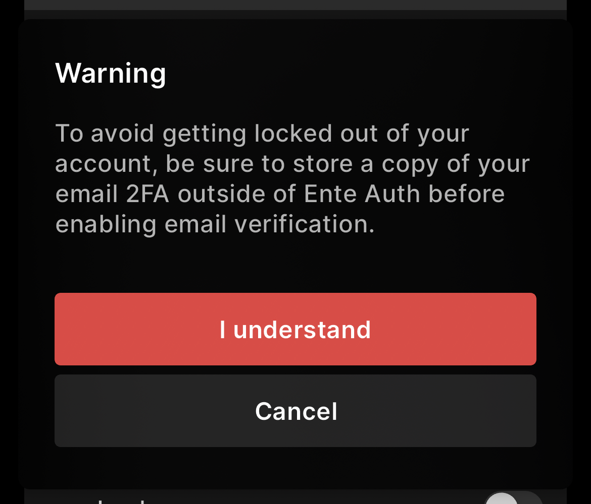

# Enteception

Your 2FA codes are in Ente Auth, but if you enable 2FA for your Ente account
itself, where should the 2FA for your Ente account be stored?

There are multiple answers, none of which are better or worse, they just depend
on your situation and risk tolerance.

If you are using the same account for both Ente Photos and Ente Auth and have
enabled 2FA from the Ente Photos app, we recommend that you ensure you store
your recovery key in a safe place (writing it down on a paper is a good idea).
This key can be used to bypass Ente 2FA in case you are locked out.

Another option is to use a separate account for Ente Auth.

Also, exporting the encrypted backup is another good way to reduce
the risk (you can easily import the encrypted backup without signing in).

Ente also offers [Legacy](/photos/features/legacy/) (emergency contacts) and support for [Passkeys](/photos/features/passkeys). Both help reduce the risk of being locked out of your Ente account.

[Legacy](/photos/features/legacy/) allows you to designate trusted contacts who can recover your account in case you are unavailable. The primary use case is to pass on your memories after your death, but it also helps recover your account in case you forget your password and recovery key. Trusted contacts can initiate account recovery, and if you do not block this within 30 days, they can reset the password and access your account.

[Passkeys](/photos/features/passkeys) serve as a modern and secure alternative to traditional 2FA codes. Instead of entering a code, you can authenticate using biometric data, hardware security keys, or device-based authentication.

## Email verification for Ente Auth

There is a related ouroboros scenario where if email verification is enabled in
the Ente Auth app _and_ the 2FA for your email provider is stored in Ente Auth,
then you might need a code from your email to log into Ente Auth, but to log
into your email you needed the Auth code.

To prevent people from accidentally locking themselves out this way, email
verification is disabled by default in the auth app. We also try to show a
warning when you try to enable email verification in the auth app:

{width=400px}

The solution here are the same as the Ente-in-Ente case.

## TL;DR;

Ideally, you should **note down your recovery key in a safe place (may be on a
paper)**, using which you will be able to by-pass the two factor.
