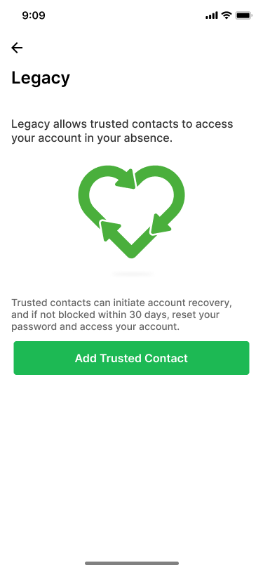
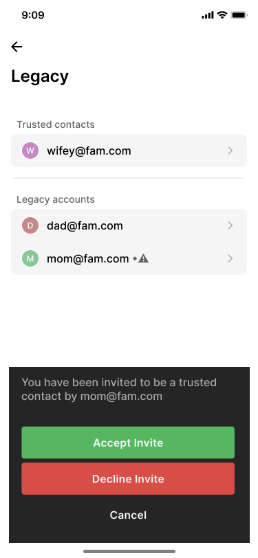
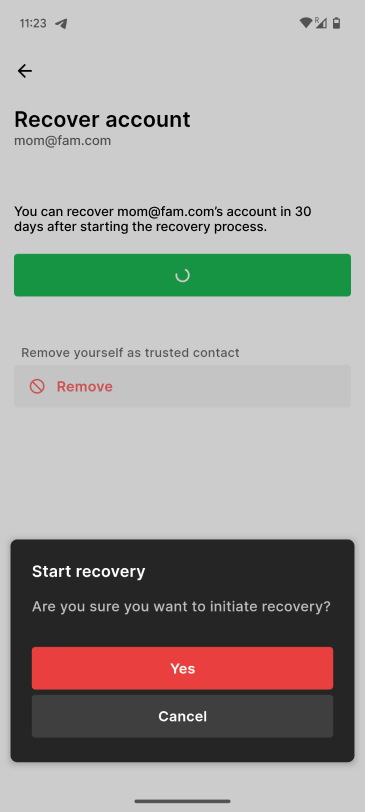

# Legacy

Legacy allows trusted contacts to recover your account in your absence. The main
usecase here is to pass on your memories after your death. It can also be useful
for other cases - for e.g., when you forget your password and recovery key.

Trusted Contacts can initiate a recovery, and if not blocked in 30 days, would
be able to change the password to your account and thereby access your memories.

## Adding a trusted contact

You can add a trusted contact for your account using the mobile app for Ente
Photos. Open `Settings > Account > Legacy`, and click on "Add Trusted Contact".

You would be asked to enter the email address of the trusted contact you want to
add or choose from a list of contacts on Ente. Please note that the trusted
contact must be an Ente user.

{width=300px}

The trusted contact must accept your request. They can do so by going to
Settings -> Account -> Legacy in the Ente Photos mobile app, and clicking on
your email address within the Legacy accounts sections. Ente would also send an
email notification to the trusted contact to nudge them to accept the invite.

{width=300px}

## Recovering an account as a trusted contact

As a trusted contact, you can recover an account by going to Settings -> Account
-> Legacy in the Ente photos app, tapping on the email address of the account
within the Legacy account sections.

{width=300px}

Once the recovery is initiated, the account owner would get 30 days to block the
recovery. After 30 days, you can go the same page in the app, where you will be
prompted to change the password of the account. Once you change the password,
you would be able to access the recovered account with the new password.

## Blocking account recovery by a trusted contact

After a trusted contact initiates a recover, you, as the account owner, would
get 30 days to block the recovery. To do this, you must go to `Settings >
Account > Legacy`, where you will see a message that recovery of the account has
been initiated. Tapping on that will allow you to block the recovery.

## Removing a trusted contact

You can remove a trusted contact by going to `Settings > Account > Legacy`,
tapping on the trusted contact you want to remove, and choosing "Remove" in the
popup.
