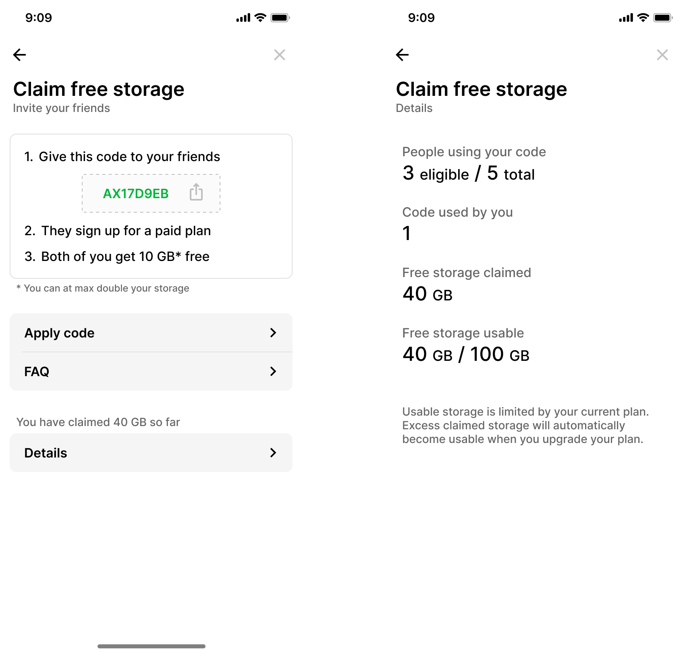
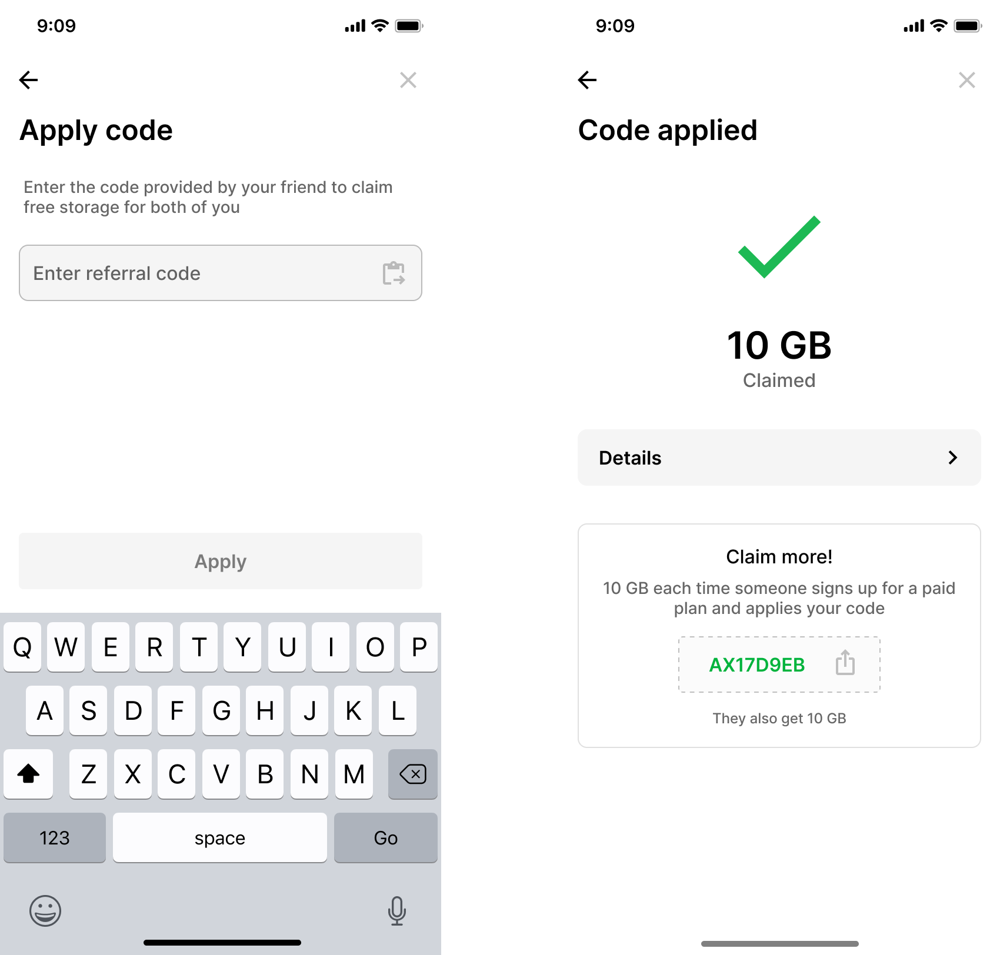

# Referral program

You can refer your friends to earn free storage on Ente.

For each friend you refer, who upgrades to a paid plan, we will credit **10 GB**
of free storage. The referred customer will also receive an additional **10 GB**
with their paid subscription.

That is, if you refer a friend, once your friend upgrades to a paid plan, both
you and your friend receive an additional 10 GB of storage.

## Find your referral code

You can find your referral code under `Settings > General > Referrals`.

{width=400px}

## Apply a referral code

Referral codes can be applied within `Settings > General > Referrals > Apply Code`.

{width=400px}

## Related FAQs

- [How much storage can I earn through referrals?](/photos/faq/storage-and-plans#referral-storage-limit)
- [For how long do I have access to referred storage?](/photos/faq/storage-and-plans#referral-duration)
- [What happens if I refer more people than my plan allows?](/photos/faq/storage-and-plans#referral-overflow)
- [What counts as abuse of the referral program?](/photos/faq/storage-and-plans#referral-abuse)

More questions? Drop a mail to [referrals@ente.io](mailto:referrals@ente.io)!
