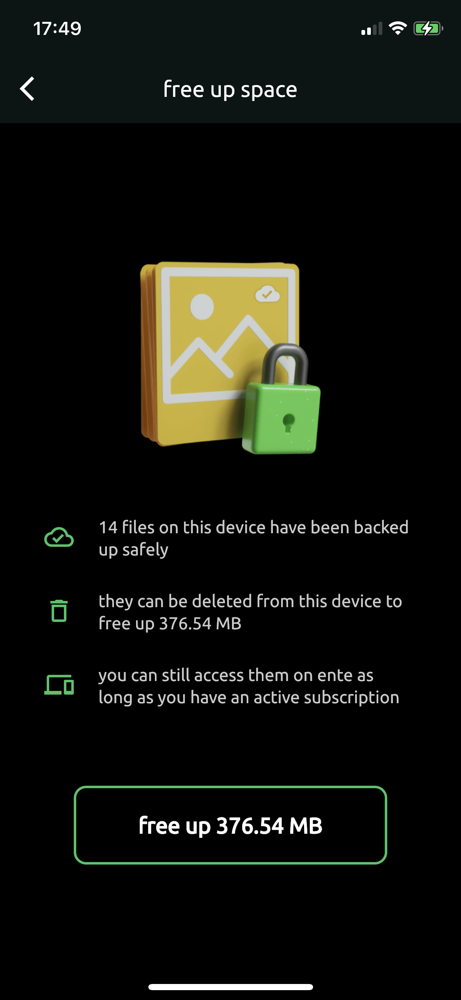

# Storage optimization

Ente provides several tools to help you optimize your storage usage - both on your devices and in your Ente cloud storage. These are manual tools you can use to clean up and manage your photo library after backup.

## Free up device space

Once your photos are safely backed up to Ente, you can free up storage space on your phone by removing local copies. Your photos remain accessible in Ente and can be downloaded anytime you need them.

### How to free up space

**On mobile (iOS and Android):**

Open `Settings > Backup > Free up space > Free up device space`, review how much space will be freed, and confirm to delete backed-up photos from your device.

{width=400px}

The app will delete all photos and videos that have been successfully backed up to Ente, leaving only photos that haven't been backed up yet.

### Important notes

**After freeing up space:**

- Your photos remain in Ente and can be viewed anytime
- Photos are automatically downloaded when you view them in the app
- You may need to clear your device's trash/recently deleted folder to fully reclaim the space

**What gets deleted:**

- Only photos that are successfully backed up to Ente
- Local copies on your device's internal storage
- Photos from your device's camera roll and other backed-up albums

**What stays:**

- Photos not yet backed up (they'll be protected from deletion)
- All photos remain in Ente's cloud
- Any photos in albums you haven't selected for backup

### Re-downloading photos

When you free up space, photos are removed from your device but stay in Ente. To view a photo:

- Simply open it in the Ente app
- It will be downloaded automatically when you view it
- Downloaded photos use your device storage again

## Remove exact duplicates

If you have an existing library with duplicate photos across different albums, you can use the manual deduplication tool to keep only one copy while maintaining your album structure.

### How it works

The deduplication tool:

1. Scans your entire Ente library for exact duplicate files (same hash)
2. Keeps one copy of each unique file
3. Replaces duplicates with symlinks in all albums
4. Your album structure remains unchanged
5. Storage space consumed by duplicates is freed up

### Using the deduplication tool

**On mobile:**

Open `Settings > Backup > Free up space > Remove duplicates`, review the duplicates found, and confirm to remove them.

**On desktop:**

Open `Settings > Deduplicate files`, review the duplicates found, and confirm to remove them.

### What happens during deduplication

- Exact duplicate files across all albums are identified
- Only one physical copy of each file is retained
- Symlinks (references) are created in all albums that had the duplicate
- Your photos remain visible in all their original albums
- Storage quota is reduced by the space occupied by removed duplicates

> **Note**: This tool only removes exact duplicates (same file hash). For similar but not identical photos, use the "Similar images" feature below.

## Remove similar images

Ente provides an ML-powered tool to find and remove photos that are similar but not exactly the same. This is useful if you've taken multiple shots of the same scene and want to keep only the best ones.

### How it works

The similar images feature:

1. Uses on-device machine learning to find visually similar photos
2. Groups similar photos together for review
3. Lets you choose which photos to keep and which to delete
4. Automatically manages symlinks to maintain album integrity
5. Works across all albums in your library

### Using the similar images tool

**On mobile:**

Open `Settings > Backup > Free up space > Similar images`, review each group of similar photos, choose which to keep and which to delete, and confirm your selections.

**On desktop:**

The "Similar images" feature is currently only available on mobile. Desktop only supports exact duplicate detection via `Settings > Deduplicate files`.

### Smart album management

When removing similar images, Ente intelligently handles your albums:

- If you delete a photo that exists in multiple albums, Ente keeps it in those albums
- If you delete the only copy of a photo from an album, Ente automatically adds a symlink to one of the kept similar photos
- This ensures no album loses all its photos from a scene
- You can safely prune similar images without worrying about album structure

### Prerequisites

The similar images feature requires:

- Machine learning to be enabled (for detecting similar images)
- Photos to be indexed (happens automatically after enabling ML)
- Available on mobile and desktop apps

Learn more about [Machine learning](/photos/features/search-and-discovery/machine-learning).

## Understanding storage in Ente

**Cloud storage (your Ente quota):**

- This is the storage space in your Ente account
- Counted against your plan's storage limit (e.g., 100 GB, 1 TB)
- Use deduplication and similar images tools to optimize

**Device storage (your phone/computer):**

- This is the physical storage on your device
- Use "Free up space" to reclaim device storage
- Photos remain in Ente and can be re-downloaded anytime

**Trash:**

- Items in trash count against your cloud storage quota
- Permanently delete items or empty trash to free up space
- Items are automatically deleted after 30 days

Learn more in [deletion feature guide](/photos/features/albums-and-organization/deleting).

## Related topics

- [Backup overview](/photos/features/backup-and-sync/)
- [Duplicate detection during backup](/photos/features/backup-and-sync/duplicate-detection)
- [Machine learning](/photos/features/search-and-discovery/machine-learning)
- [Deleting photos](/photos/features/albums-and-organization/deleting)
- [Storage and Plans FAQ](/photos/faq/storage-and-plans)

## Related FAQs

- [How can I free up space on my device?](/photos/faq/albums-and-organization#free-up-device-space)
- [Will I lose my photos when freeing up device space?](/photos/faq/albums-and-organization#free-up-space-safe)
- [Can I choose which photos to delete from my device?](/photos/faq/albums-and-organization#selective-device-deletion)
- [How much space will I free up?](/photos/faq/albums-and-organization#how-much-space-freed)
- [Will new photos still backup automatically?](/photos/faq/albums-and-organization#backup-after-free-space)
- [How can I remove duplicate photos?](/photos/faq/albums-and-organization#remove-duplicates)
- [What's the difference between duplicates and similar images?](/photos/faq/albums-and-organization#duplicates-vs-similar)
- [Does removing duplicates affect automatic duplicate detection?](/photos/faq/albums-and-organization#manual-vs-auto-dedup)
