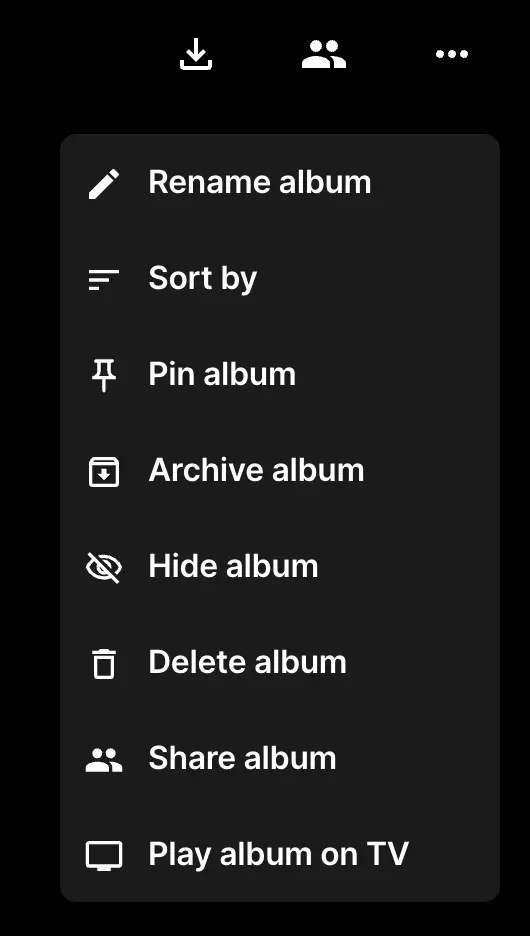
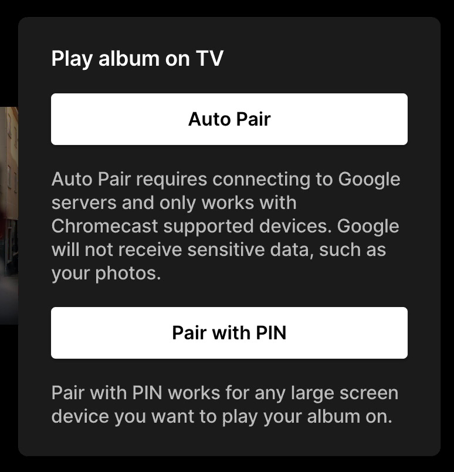
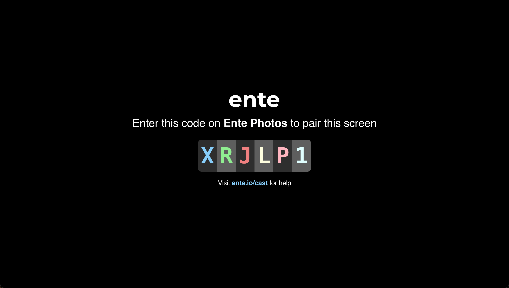

# Cast

With Ente Cast, you can play a slideshow of your favourite albums on your Google
Chromecast TVs or any other internet-connected large screen devices.

## Get Started

1. Open Ente on the web or on your mobile device.
2. Select the album you want to play on your large screen device.
3. Click "Play album on TV" in the album menu.

    On the web, you can find this option in the three dots menu on the right
    hand side.

{width=300px}

4. Choose how you want to pair your device with your large screen device.

    

    {width=300px}

    

    On Google Chrome and other Chromium browsers, you will see a button labeled
    "Auto Pair". This option will prompt you to select a Chromecast supported
    device on your local network. Note: this option requires connecting to
    Google servers to load necessary dependencies. This option does not transmit
    any sensitive data through Google servers, such as your photos. Once your
    Chromecast device is connected, you're all set.

    On all browsers, you'll see the option to "Pair with PIN". This option works
    with all devices, Chromecast-enabled or not. You'll be required to load up
    [cast.ente.io](https://cast.ente.io) on your large screen device.

5. Enter the PIN displayed on your large screen device into the input field on
   your mobile or web device.

    On your large screen device, you'll see the following screen.

6. Once you enter the correct PIN, you will see a screen on your TV with a green
   checkmark confirming the connection. Your photos will start showing up in a
   bit.
