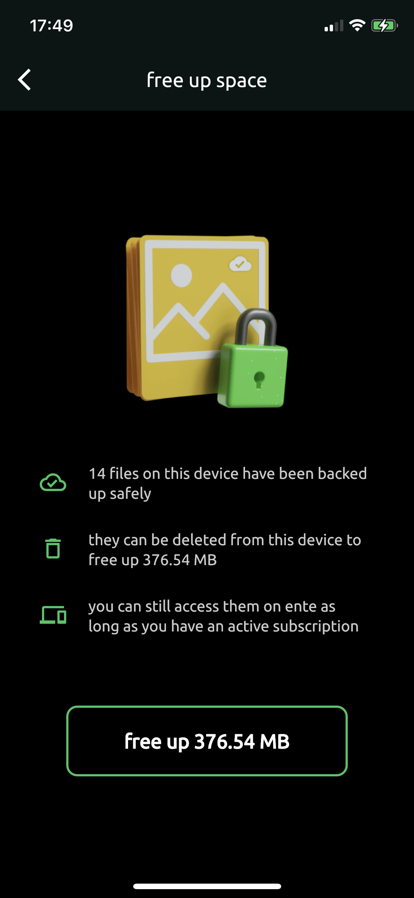

# Free up your phone's storage space

Within the app's settings page, you have an option to free up space by deleting
all backed up photos and videos from your phone's internal storage.

{width=400px}

> Note: You might have to clear the device's trash to realize this cleared
> space.
