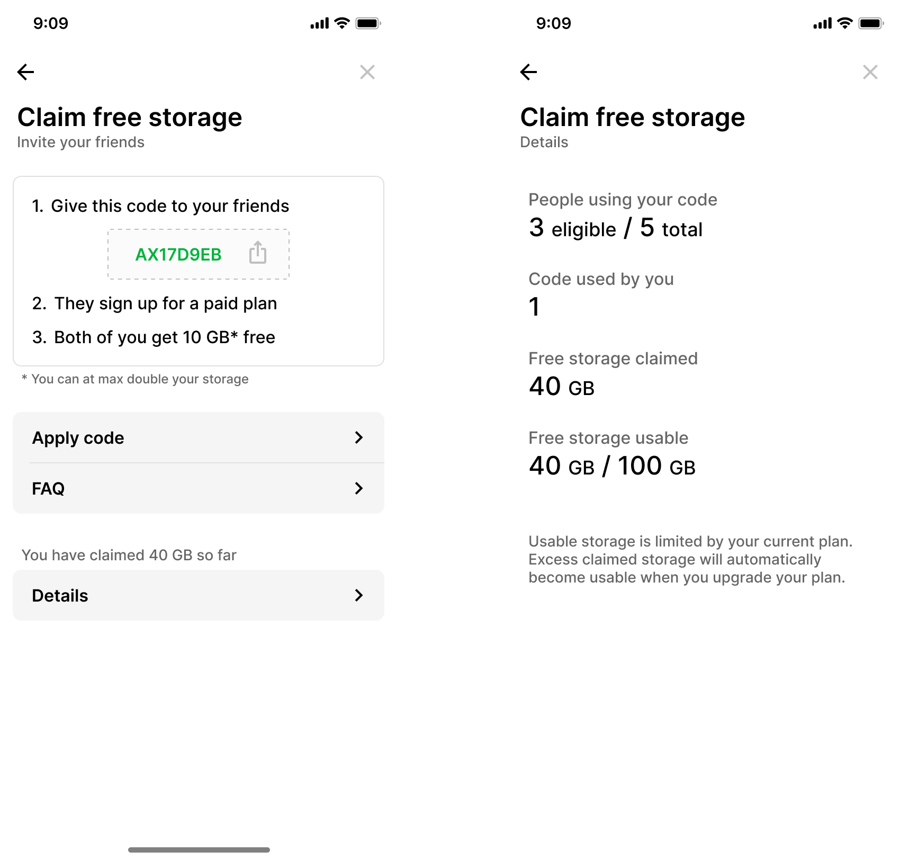
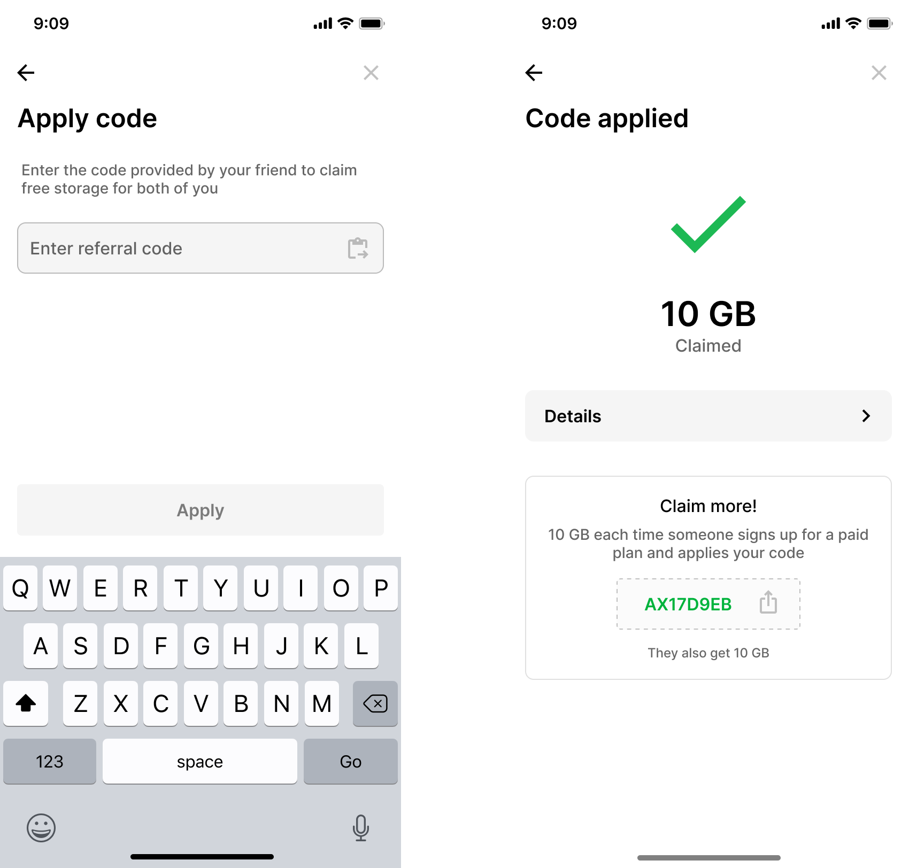

# Referral program

You can refer your friends to earn free storage on Ente.

For each friend you refer, who upgrades to a paid plan, we will credit **10 GB**
of free storage. The referred customer will also receive an additional **10 GB**
with their paid subscription.

That is, if you refer a friend, once your friend upgrades to a paid plan, both
you and your friend receive an additional 10 GB of storage.

You can find your referral code under _Settings → General → Referrals_.

{width=400px}

### How much storage can I earn?

The amount of free storage you can earn is capped to your current plan. This
means, you can at max <u>double your storage</u>. For example, if you're on a
100 GB plan, you can earn another 100 GB (by referring 10 friends), taking your
total available storage to 200 GB.

You can keep track of your earned storage and referral details on _Claim free
storage_ screen.

If you refer more paid customers than is allowed by your current plan, the extra
storage earned will be reserved and will become usable once you upgrade your
plan.

### For how long do I have access to this storage?

Earned storage will be accessible as long as your subscription is active,
provided there has been no abuse.

In case our systems detect abuse, we may notify you and take back credited
storage. Low quality referrals (who don't renew their plans) or creation of fake
accounts, etc. could result in this.

### How can my friends apply my referral code?

Referral codes can be applied within _Settings → General → Referrals → Apply
Code_.

{width=400px}

---

More questions? Drop a mail to [referrals@ente.io](mailto:referrals@ente.io),
and we'll get back to you!
