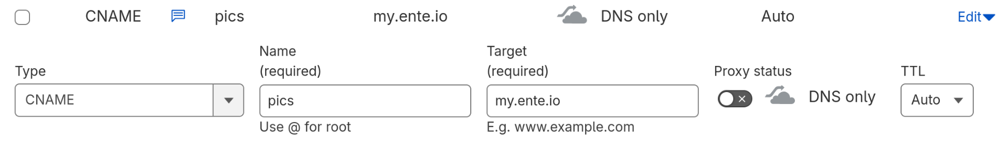

# Custom domains

Custom domains allow you to serve your public links with your own personalized domain.

For example, if I have an Ente album and wish to share it with my friends, I can open the album's sharing settings and create a public link. When I copy this link, it will be of the form of

```
https://albums.ente.io/?t=...
```

The custom domains feature allows you to instead create a link that uses your own domain, say

```
https://pics.example.org/?t=...
```

You don't need to run any servers or manage any services, Ente will still host and serve your album for you, the only thing that changes is that you can serve your links using your personalized domain.

## Availability

The custom domains feature is available to all Ente users, including those on the free tier.

## Setup

The setup involves two steps:

1. Letting Ente know about the domain you wish to use for serving your public links
2. Updating your DNS settings to point your domain (or subdomain) to **my.ente.io**

For people who are comfortable with changing DNS settings on their domain provider, this entire process is very simple will take a minute. For people who are not comfortable with changing DNS, we will provide a more detailed breakdown below.

Let's dive in.

To make the process concrete, let's assume we're trying to use _pics.example.org_ as our custom domain. Note that there is no restriction to use a subdomain, a top level domain can be used as a custom domain too. That is, either of _example.org_ or _subdomain.example.org_ is fine, Ente will work with both.

### Step 1 - Link your domain

The first step is to let Ente know about the domain or subdomain you wish to use by linking it to your account.

Head over to Settings > Preferences > Custom domains, in the domain field enter "pics.example.org" (replace with your subdomain) and press "Save". That's it. The linking is done.

### Step 2 - Add DNS entry

The second step is to add a CNAME entry in your DNS provider that forwards requests for pics.example.org (replace with your subdomain) to **my.ente.io**.

Specifically, you need to add a `CNAME record` from the domain (or subdomain) of your choice to `my.ente.io`. You can leave the `TTL` at its default.

| Record Type |            Name            |        Value | TTL            |
| ----------- | :------------------------: | -----------: | -------------- |
| CNAME       | Your subdomain, e.g `pics` | `my.ente.io` | Auto (default) |

The exact steps for doing this depend on the DNS provider that you're using.

> Your DNS provider usually is the service from which you bought your domain. The domain name seller will provide some sort of an admin panel where you can configure your DNS settings.

As concrete examples, here is how this step would look for Cloudflare:



Note that orange proxy option is off. And here is how it would look for Namecheap:


> [!NOTE]
>
> The examples are using "pics" as the subdomain, but that's just an example, you can use anything you like (or use "@" if you'd like to use the root domain itself).

The time it takes for DNS records to update is dependent on your DNS provider. Usually the changes should start reflecting within a few minutes, and should almost always reflect within an hour.

Once the DNS changes have been applied, then you can take any public link to your shared albums, replace `albums.ente.io` with your choice (e.g. `pics.example.org`), and the link will still work.

You don't need to do this manually though, the apps will do it for you. More on this in the next section. But first, some troubleshooting tips.

### Troubleshooting

If your domain is not working, go through the following checklist.

- The CNAME should be from your domain to my.ente.io, not the other way around. That is, `pics.example.org => my.ente.io`.

- If you're using Cloudflare DNS, make sure that the "Orange" proxy status toggle is off, and the Proxy status is the "Grey" DNS only.

## Using

Using is trivial. When you open an album's sharing options and copy the link to it, Ente will automatically copy the link that uses your configured domain.

## Unsetting

To stop using your custom domain, we need to undo the two steps we did during setup.

1. Unlink your domain in Ente. This can be done just by going to Settings > Preferences > Custom Domains, clearing the value in the "Domain" input and pressing "Update".

2. Remove the CNAME record you added during setup in your DNS provider.

## Implementation

Our engineers also wrote [explainer](https://ente.io/blog/custom-domains/) of how this works behind the scenes.
