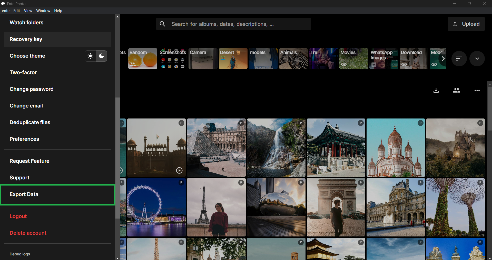
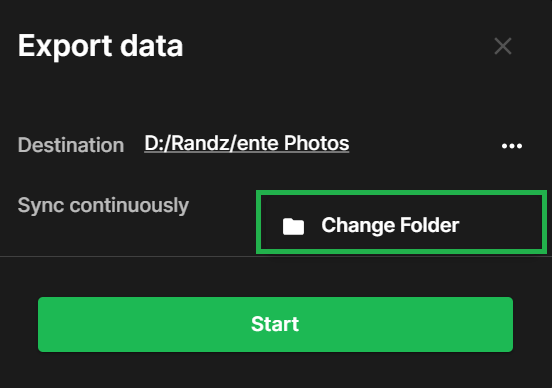
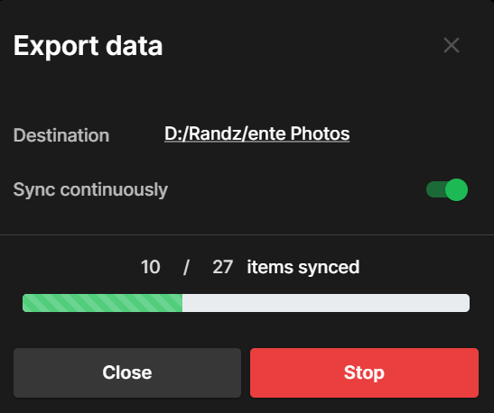

# Exporting your data out of Ente Photos

Please follow the following simple steps to keep a local copy of the photos and
videos you have uploaded to Ente.

1. Sign in to [our desktop app](https://ente.io/download/desktop), if you
   haven't done so already.

2. Open the side bar, and select the option to **export data**.

    

3. Select the destination folder and click on **start**.

    

4. Wait for the export to get completed.

    

5. Later on if you wish to sync newer files that were uploaded since the last
   time you exported, simply select **export data** again and click on
   **resync**.

    

6. In case your download gets interrupted, Ente will resume from where it left
   off. Simply select **export data** again and click on **resync**.

7. **Sync continuously** : You can utilize Continuous Sync to eliminate manual
   exports each time new photos are added to Ente. This feature automatically
   detects new files and runs exports accordingly, It also ensures that exported
   data reflects the latest album states with new files, moves, and deletions.

    

If you run into any issues during your data export, please reach out to
[support@ente.io](mailto:support@ente.io) and we will be happy to help you!

Note that we also provide a [CLI
tool](https://github.com/ente-io/ente/tree/main/cli#export) to export your data.
Some more details are in this [FAQ entry](/photos/faq/export).
