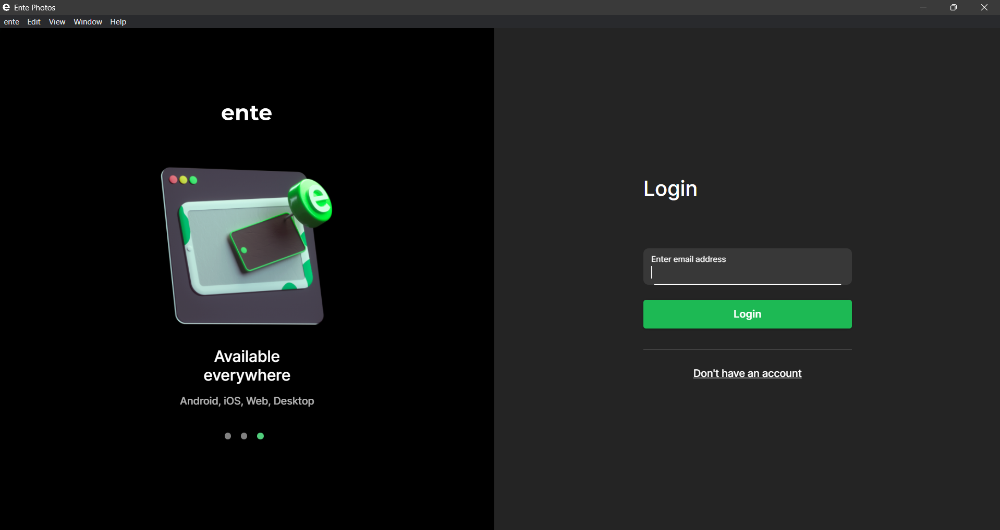
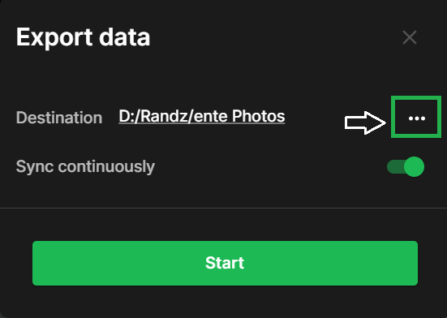
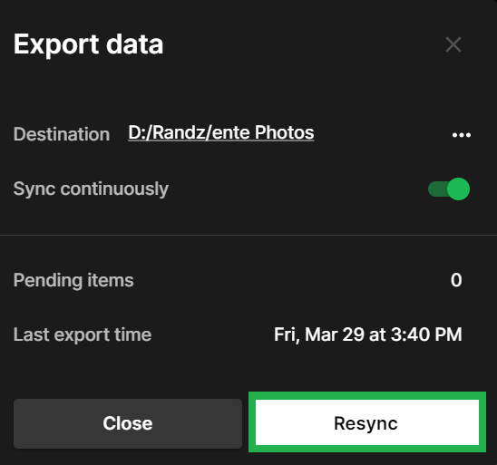
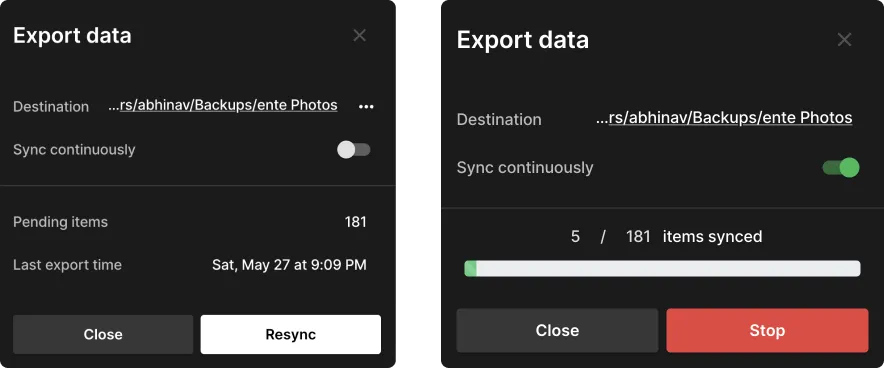

# Exporting your data out of Ente Photos

Please follow the following simple steps to keep a local copy of the photos and
videos you have uploaded to Ente.

1. Sign in to [our desktop app](https://ente.io/download/desktop), if you
   haven't done so already.

    

2. Open the side bar, and select the option to **Export Data**.

    

3. Choose the destination folder by clicking on three dots icon.

{width=400px}

4. Select the folder and then click on **Start**

{width=400px}

5. Wait for the export to complete.

{width=400px}

6. In case your download gets interrupted, Ente will resume from where it left
   off. Simply select **Export Data** again and click on **Resync**.

{width=400px}

### Sync continuously

You can switch on the toggle to **Sync continuously** to eliminate manual
exports each time new photos are added to Ente. This feature automatically
detects new files and runs exports accordingly. It also ensures that exported
data reflects the latest album states with new files, moves, and deletions.

---

If you run into any issues during your data export, please reach out to
[support@ente.io](mailto:support@ente.io) and we will be happy to help you!

Note that we also provide a
[CLI tool](https://github.com/ente-io/ente/tree/main/cli#export) to export your
data.
