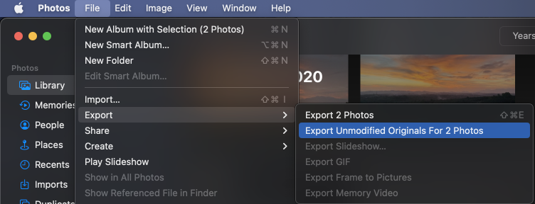
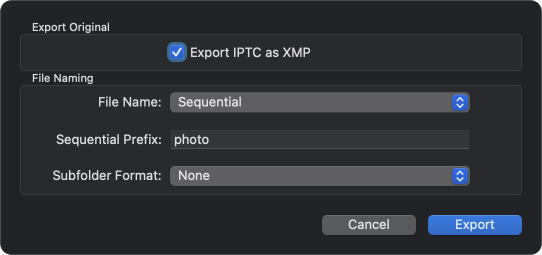

# Import from Apple Photos

## Mobile

If you are using Apple Photos on your phone, then the most seamless way is to
install the Ente app on your mobile device. The Ente app will directly read from
your iCloud library and import.

> [!TIP]
>
> For large libraries, this process may take a bit of time, so you can speed it
> up by keeping the app running in the foreground while the initial import is in
> progress. You can do this by going to `Settings > Backup > Backup settings` and
> turning on "Disable auto lock"
> (Note: this is only needed during the initial import, subsequently
> the app will automatically backup photos in the background as you take them).

## Desktop

Alternatively, or if you prefer to use the desktop app, then you can use the
following steps:

#### 1. Export your data from the Apple Photos app.

Select the files you want to export (`Command + A` to select them all), and
click on `File` > `Export` > `Export Unmodified Originals`.

In the dialog that pops up, select File Name as `Sequential` and provide any
prefix you'd like. This is to make sure that we combine the photo and video
portions of your Live Photos correctly.

Finally, choose an export directory and confirm by clicking `Export Originals`.
You will receive a notification from the app once your export is complete.

#### 2. Import into Ente

Now simply drag and drop the downloaded folders into
[our desktop app](https://ente.io/download/desktop) and grab a cup of coffee (or
a good night's sleep, depending on the size of your library) while we handle the
rest.

> Note: In case your uploads get interrupted, just drag and drop the folders
> into the same albums again, and we will ignore already backed up files and
> upload just the rest.

If you run into any issues during this migration, please reach out to
[support@ente.io](mailto:support@ente.io) and we will be happy to help you!
