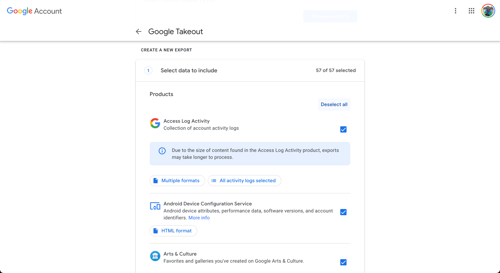
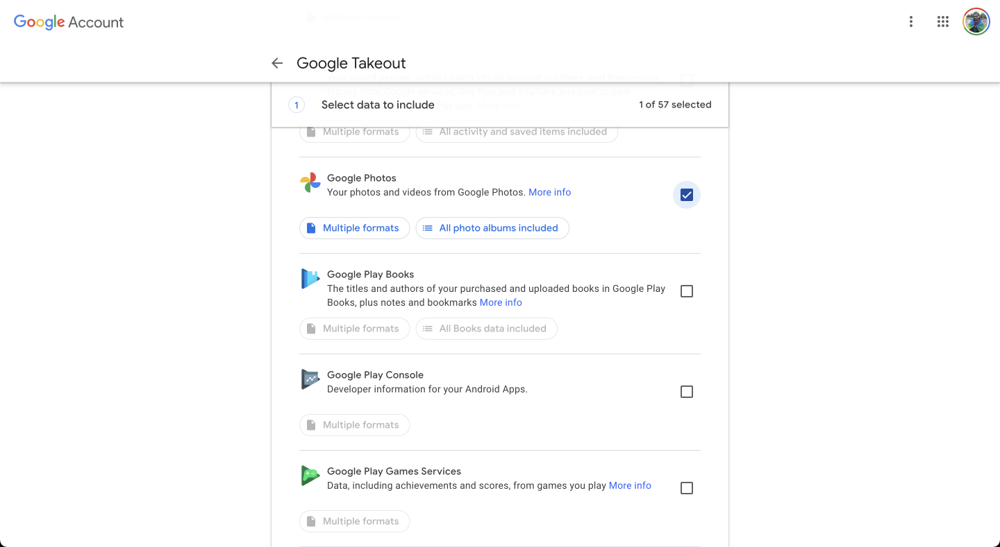
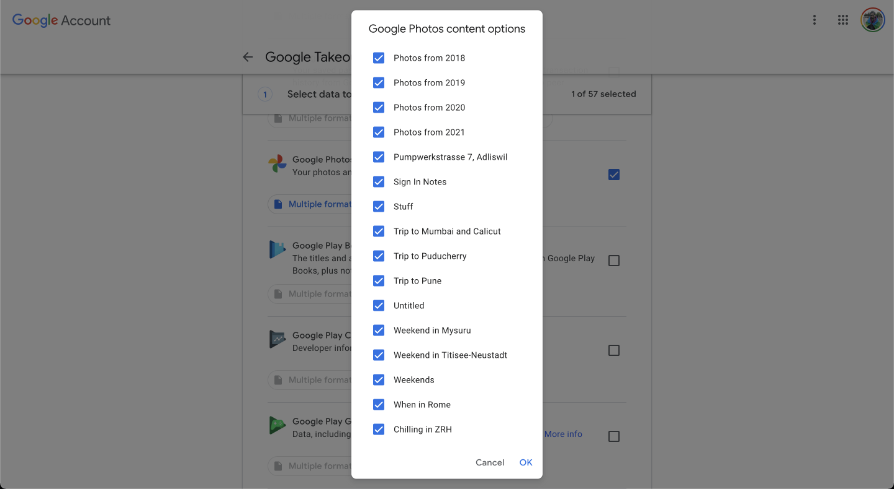
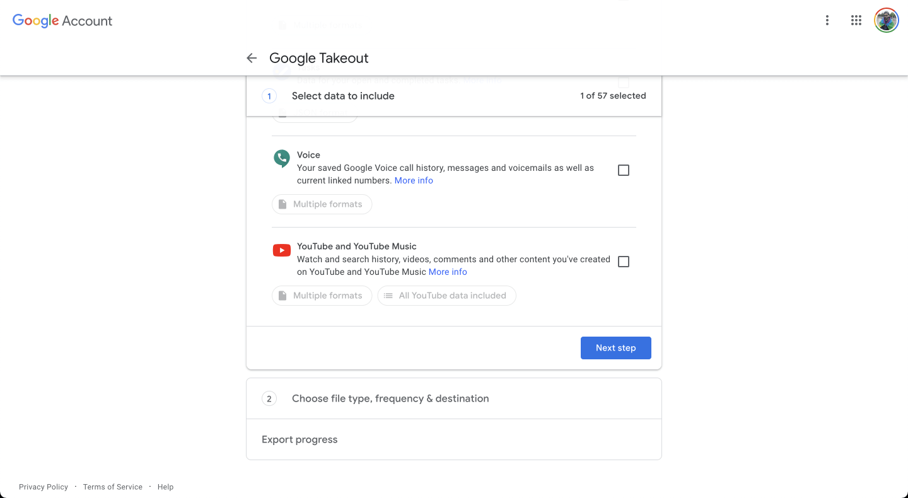
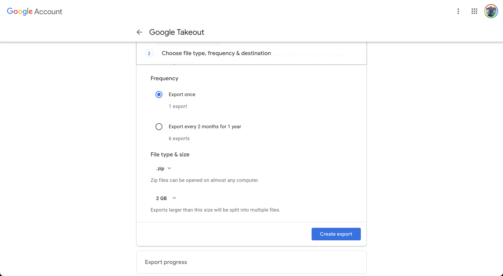
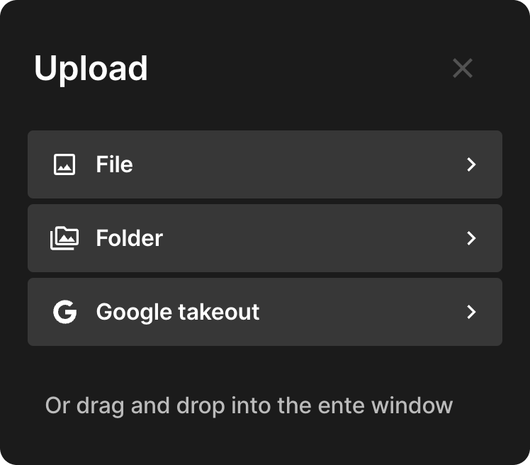
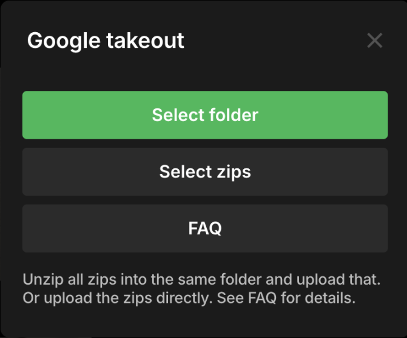
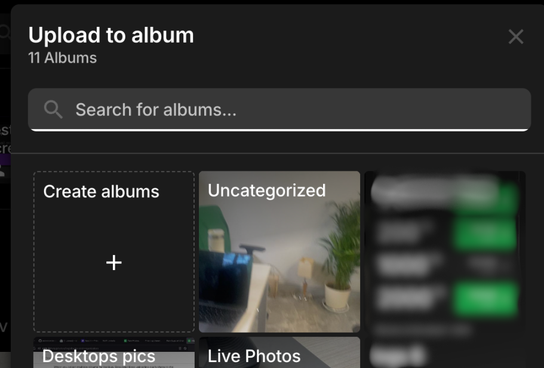

# Import from Google Photos

Follow the following steps to recover your data from Google Photos and preserve
it with Ente.

### Steps

1. Open [takeout.google.com](https://takeout.google.com).

2. Click on "Deselect All" (since by default all Google services are selected).

    

3. Scroll down to find Google Photos in the list and select it by clicking the
   check box next to it.

    

4. Click on the button that says "All photo albums included".

5. Select the albums you want to export.

    

6. Scroll down and click on "Next Step".

    

7. Select "Frequency" and "File size" depending on the amount of storage on your
   system and click on "Create export". Make sure you select ZIP as the format.

    

8. Wait for Google to send you your data.

9. Open [our desktop app](https://ente.io/download/desktop) and click on "Upload", then select "Google takeout".

    {width=400px}

    You'll see two options:
    - **Select folder (recommended): If you have multiple ZIP files, extract them all into one folder first, then select that folder. This ensures proper metadata matching ([details](/photos/faq/metadata-and-editing#importing-from-google-takeout)).**
    - **Select zips**: Choose your ZIP files directly without extracting. Convenient but may not properly match metadata if files are split across ZIPs.

        

10. Choose where to import your photos:

    **If you selected a folder**, decide whether you want to:
    - **Import to existing album** → Pick one of your current albums, or
    - **Create new album(s)** → Click "Create albums", then:
        - If your folder has subfolders: Choose between "Separate albums" (each folder becomes its own album) or "Single album" (everything goes into one album)
          
        - If it's a single folder: Just name your new album

    **If you selected ZIP files directly**:
    - Photos are automatically organized into separate albums based on the folder structure within the ZIPs

11. Wait for the uploads to complete. Ente will parse Google's metadata and preserve everything with your photos, end-to-end encrypted!

---

In case your uploads get interrupted, just drag and drop the folder or files again. Ente will automatically ignore already backed up files and upload just the rest.

If you run into any issues during this migration, please reach out to
[support@ente.io](mailto:support@ente.io) and we will be happy to help you!

> [!TIP]
>
> In case you wish to use face recognition and other advanced search features
> provided by Ente, we recommend that you enable
> [machine learning](/photos/features/search-and-discovery/machine-learning) before importing your
> photos so that the Ente app can directly index files as they are getting
> uploaded.
