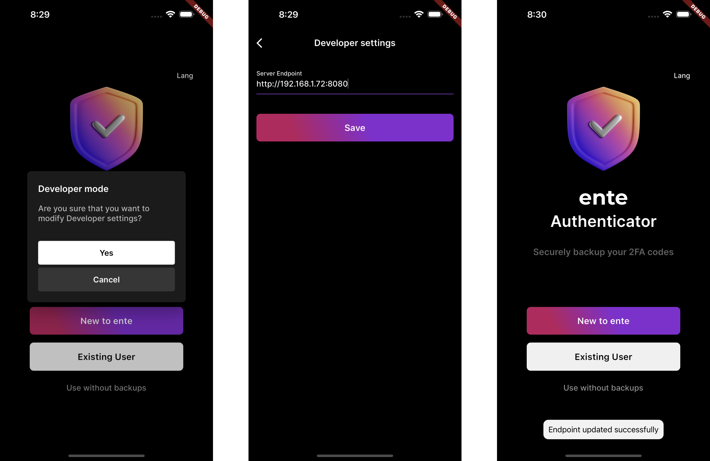
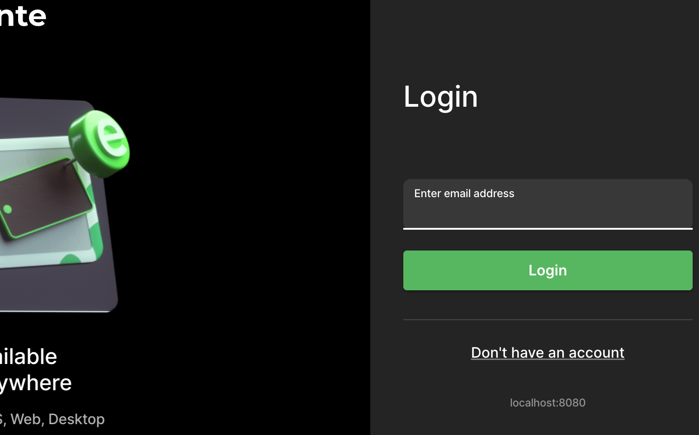

# Connecting to a custom server

You can modify various Ente client apps and CLI to connect to a self hosted
custom server endpoint.

## Mobile

The pre-built Ente apps from GitHub / App Store / Play Store / F-Droid can be
easily configured to use a custom server.

You can tap 7 times on the onboarding screen to bring up a page where you can
configure the endpoint the app should be connecting to.



## Desktop and web

Same as the mobile app, you can tap 7 times on the onboarding screen to
configure the endpoint the app should connect to.

<div align="center">

{width=400px}

</div>

This works on both the desktop app and web app (if you deploy on your own).

> [!CAUTION]
>
> This setting is currently available in the nightly builds of the desktop app.
> It'll be available in the regular builds with the upcoming release (1.7.2).

To make it easier to identify when a custom server is being used, app will
thereafter show the endpoint in use (if not Ente's production server) at the
bottom of the login prompt:



Similarly, it'll be shown at other screens during the login flow. After login,
you can also see it at the bottom of the sidebar.

Note that the custom server configured this way is cleared when you reset the
state during logout. In particular, the app also does a reset when you press the
change email button during the login flow.

### Building from source

Alternatively (e.g. if you don't wish to configure this setting and just want to
change the endpoint the client connects to by default), you can build the app
from source and use the `NEXT_PUBLIC_ENTE_ENDPOINT` environment variable to tell
it which server to connect to. For example:

```sh
NEXT_PUBLIC_ENTE_ENDPOINT=http://localhost:8080 yarn dev:photos
```

For more details, see
[hosting the web app](https://help.ente.io/self-hosting/guides/web-app).

## CLI

> [!NOTE]
>
> You can download the CLI from
> [here](https://github.com/ente-io/ente/releases?q=tag%3Acli-v0)

Define a config.yaml and put it either in the same directory as where you run
the CLI from ("current working directory"), or in the path defined in env
variable `ENTE_CLI_CONFIG_PATH`:

```yaml
endpoint:
    api: "http://localhost:8080"
```

(Another
[example](https://github.com/ente-io/ente/blob/main/cli/config.yaml.example))
