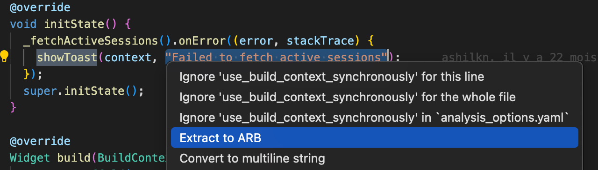
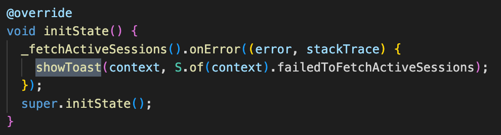
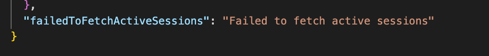
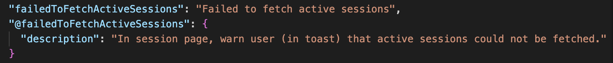

# Translations

We use Crowdin for translations, and the `intl` package to load these at
runtime.

Within our project we have the _source_ strings - these are the key value pairs
in the `lib/l10n/intl_en.arb` file.

Volunteers can add a new _translation_ in their language corresponding to each
such source key-value to our
[Crowdin project](https://crowdin.com/project/ente-photos-app).

When a new source string is added, we run a [GitHub workflow](../../.github/workflows/mobile-crowdin-push.yml)
that

-   Uploads sources to Crowdin - So any new key value pair we add in the source
    `intl_en.arb` becomes available to translators to translate.

Every monday, we run a [GitHub workflow](../../.github/workflows/mobile-crowdin-sync.yml)
that 

-   Downloads translations from Crowdin - So any new translations that
    translators have made on the Crowdin dashboard (for existing sources) will
    be added to the corresponding `intl_XX.arb`.

The workflow also uploads existing translations and also downloads new sources
from Crowdin, but these two should be no-ops.

## Adding a new string

While it is technically possible to perform the following actions using command lines, it is recommended to use Visual Studio Code with the [Flutter](https://marketplace.visualstudio.com/items?itemName=localizely.flutter-intl) extension, for ease of use.

1. Open Visual Studio Code, with the Flutter Intl extension installed, in 
the `mobile` directory
1. Select the string you want to extract, including the quotation marks
1. Press '`Ctrl + .`' (or '`command + .`' on Mac) to open quick actions, and press "Extract to ARB" (if it is 
not showing, check that you have not opened the full `ente` repository instead of the `mobile` folder).
    

    

    

    That should replace the string..

    

    

    

    .. and generate/modify the arb files.

    

    

    

1. (optional) You might want to add more context to the extracted string in the
source `intl_en.arb` file

    

    

    

1. Make sure the file in which you have extracted the string has the following 
import:

    `import "package:photos/generated/l10n.dart"`

1. Commit the changes and create a PR in which it is advised to tag at least one 
of the developers (i.e. [laurenspriem](https://github.com/laurenspriem))

1. During the next sync, the workflow will upload new source strings to Crowdin's 
dashboard, allowing translators to translate it.

## Updating an existing string

1. Update the existing value for the key in the source `intl_en.arb`.
1. Commit the changes and create a PR in which it is advised to tag at least one of 
the developers (i.e. [laurenspriem](https://github.com/laurenspriem))
1. During the next sync, the workflow will upload new source strings to Crowdin's 
dashboard, allowing translators to translate it.

## Deleting an existing string

1. Remove the key value pair from the source `intl_en.arb`.
1. Commit the changes and create a PR in which it is advised to tag at least one of 
the developers (i.e. [laurenspriem](https://github.com/laurenspriem))
1. During the next sync, the workflow will delete that source item from all
    existing translations (both in the Crowdin project and also from the
    other `intl_XX.arb` files in the repository).
