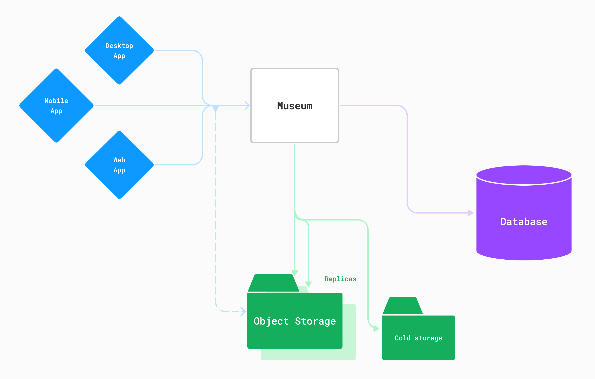

# Museum

API server for [ente.io](https://ente.io)

We named our server _museum_ because for us and our customers, personal photos
are worth more than any other piece of art.

Both Ente Photos and Ente Auth use the same server (intentionally). This allows
users to use the same credentials to store different types of end-to-end
encrypted data without needing to create new accounts. We plan on building more
apps using the same server – this is easy, because the server is already data
agnostic (since the data is end-to-end encrypted).

## Getting started

Start a local cluster

    docker compose up --build

And that's it!

You can now make API requests to localhost, for example

    curl http://localhost:8080/ping

Let's try changing the message to get the hang of things. Open `healthcheck.go`,
change `"pong"` to `"kong"`, stop the currently running cluster (`Ctrl-c`), and
then rerun it

    docker compose up --build

And ping again

    curl http://localhost:8080/ping

This time you'll see the updated message.

> [!TIP]
>
> You can also use pre-built Docker images to directly start a cluster without
> needing to clone this repository - see
> [docs/quickstart.md](docs/quickstart.md).

For more details about how to get museum up and running, see
[RUNNING.md](RUNNING.md).

## Architecture

With the mechanics of running museum out of the way, let us revisit the diagram
we saw earlier.

It is a long term goal of ours to make museum redundant. The beauty of an
end-to-end encrypted architecture is that the service provider has no special
conceptual role. The user has full ownership of the data at all points, and
using suitably advanced clients the cloud storage and replication can be
abstracted away, or be handled in a completely decentralized manner.

Until we get there, museum serves as an assistant for various housekeeping
chores.

* Clients ([mobile](../mobile), [web](../web) and [desktop](../desktop)) connect
  to museum on the user's behalf. Museum then proxies data access (after adding
  yet another layer of authentication on top of the user's master password),
  performs billing related functions, and triggers replication of encrypted user
  data.

* The end-to-end encrypted cryptography that powers all this is [documented
  here](https://ente.io/architecture)

* Details about the 3 (yes 3!) clouds where the encrypted data and database are
  replicated to are [documented here](https://ente.io/reliability)

Museum's architecture is generic enough to support arbitrary end-to-end
encrypted storage. While we're currently focusing on building a great photo
storage and sharing experience, that's not a limit. For example, we already use
museum to also provide an [end-to-end encrypted open source 2FA app with cloud
backups](../auth).

## Self hosting

Museum is a single self-contained Docker image that is easy to self-host.

When we write code for museum, the guiding light is simplicity and robustness.
But this also extends to how we approach hosting. Museum is a single statically
compiled binary that can be put anywhere and directly run.

And it is built with containerization in mind - both during development and
deployment. Just use the provided Dockerfile, configure to taste and you're off
to the races.

Overall, there are [three approaches](RUNNING.md) you can take:

* Run using Docker using a pre-built Docker image
* Run using Docker but build an image from source
* Run without Docker

Everything that you might needed to run museum is all in here, since this is the
code we ourselves use in production.

> [!TIP]
>
> On our production servers, we wrap museum in a [systemd
> service](scripts/deploy/museum.service). Our production machines are vanilla
> Ubuntu images, with Docker and Promtail installed. We then plonk in this
> systemd service, and use `systemctl start|stop|status museum` to herd it
> around.

Some people new to Docker/Go/Postgres might have general questions though.
Unfortunately, because of limited engineering bandwidth **we will currently not
be able to prioritize support queries related to self hosting**, and we request
you to please not open issues around self hosting for the time being (feel free
to create discussions though). The best way to summarize the status of self
hosting is – **everything you need is here, but it is perhaps not readily
documented, or flexible enough.**

That said, we hope community members help each other out, e.g. in this
repository's [Discussions](https://github.com/ente-io/ente/discussions), or on
[our Discord](https://discord.gg/z2YVKkycX3). And whenever time permits, we will
try to clarify, and also document such FAQs. Please feel free to open
documentation PRs around this too.

> [!TIP]
>
> For more documentation around self-hosting, see
> **[ente.io/help/self-hosting](https://ente.io/help/self-hosting)**.

## Thanks ❤️

We've had great fun with this combination (Golang + Postgres + Docker), and we
hope you also have fun tinkering with it too. A big thank you to all the people
who've put in decades of work behind these great technologies. Truly, on the
shoulders of giants we stand.
